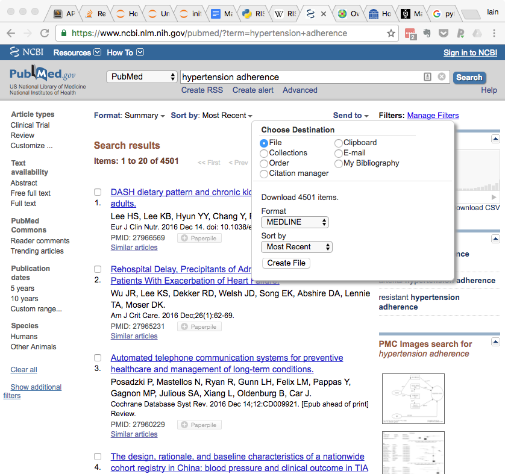

# RobotSearch

Welcome to RobotSearch, software for filtering RCTs from a search result as described in [our paper](https://doi.org/10.1002/jrsm.1287) in the Journal of Research Synthesis Methods.

[Marshall I, Storr AN, Kuiper J, Thomas J, Wallace BC. Machine Learning for Identifying Randomized Controlled Trials: an evaluation and practitioner's guide. Res Syn Meth. 2018. https://doi.org/10.1002/jrsm.1287](https://doi.org/10.1002/jrsm.1287)

Currently this software runs from the Command Prompt (in Windows), or the Terminal (in Mac, or Linux), though we will work in future to make using the tool even easier. (If you are in a position to help with this, please see below!)

## Installation instructions

1. Before installing RobotSearch, you will need to install Python 3. We recommend that you use the MiniConda Python distribution (N.B. choose version 3.6 or higher). You can download this [here](https://conda.io/miniconda.html).

2. Open up the Terminal (or Command Prompt in Windows). This is also how you will interact with RobotSearch when you use it.

3. Install RobotSearch using the following command (easiest to copy/paste):
	`pip install -U https://github.com/ijmarshall/robotsearch/archive/master.zip`

4. RobotSearch should be automatically downloaded and installed on your machine. The software is >200MB in size, so this process may take some time depending on how fast your internet connection is.

5. You should be ready to go!

## How it works

RobotSearch uses machine learning as an alternative to string-based study design filters.

It works with MEDLINE searches exported from either PubMed or Ovid. 

1. You should conduct your search as normal (NB do not use any search terms or filters to restrict to RCTs at this stage!).

2. Then export your results in RIS format (see more detailed instrutions below on how to do this in PubMed and Ovid)

3. From the Command Prompt/Terminal, run the robotsearch command:
`robotsearch my_file.ris`

4. Your search results will be saved as `my_file_robotreviewer_RCTs.ris`

## Changing settings

By default, RobotSearch runs a *sensitive* search (i.e. very high likelihood that *all* RCTs will be retrieved, at expense of sometimes including non-RCTs) - this is suitable for a systematic review.

To run a *precise* search (i.e. the retrieved articles have a very high likelihood of being RCTs, but at the expense of missing a tiny proportion), run with an extra `-p` flag, e.g.:

`robotsearch my_file.ris -p`

## Exporting from PubMed

1. Select 'Send to' (located in the upper left of the search results)
2. Under 'Choose Destination' select File
3. Under 'Format', select 'MEDLINE' from the pulldown menu
4. Click the 'Create File' button

## Exporting from Ovid

 (**Endnote** format includes the 'publication type' field, the **RIS** format does not)

1. Click the tickbox next to **'All'** above the search results on the left hand side.
2. Click on Export
3. In the **'Export to'** pulldown menu, select 'RIS'
4. Under **'Select Fields to Display'** select 'Custom Fields', then click the 'Select Fields' button
5. In the **Select Fields** box, select the following fields: *ab*: Abstract, *pt*: Publication Type, and *ti*: Title. You may deselect any others.
6. Click 'Save' in the bottom left
7. Click 'Export Citation(s)' in the bottom right
8. The citations will be exported, but there may be a wait of a minute or two.

## Testing

RobotSearch has a optional test mode, which runs through a standardised search result, and double checks that the software is returning the same results as in the validation study. NB this takes around 5--10 minutes to run, depending on the speed of your machine.

To run this, type:

`robotsearch -t	`

## Contributing/Using our machine learning in other tools

We would love software developers, and people who make biblographic databases to integrate this method into their systems. All the software is open source under the GNU GPL v3. Please contact us ([mail@ijmarshall.com](mailto:mail@ijmarshall.com)) to discuss further.

We also welcome contributions from the community; please contact us (or submit an issue via Github) if you are interested in improving the software. We're keen to make sure it is as easy to use as possible by non-programmers—any contributions to help with this aim are particularly welcome.

## Using RobotSearch as a Python module

RobotSearch may be called as a Python module, from within the root directory. See the [example IPython notebook](Calling RobotSearch as a Python module.ipynb) for how to do this.

## Support

This work is supported by: National Institutes of Health (NIH) under the National Library of Medicine, grant R01-LM012086-01A1, "Semi-Automating Data Extraction for Systematic Reviews", and by NIH grant 5UH2CA203711-02, "Crowdsourcing Mark-up of the Medical Literature to Support Evidence-Based Medicine and Develop Automated Annotation Capabilities", and the UK Medical Research Council (MRC), through its Skills Development Fellowship program, grant MR/N015185/1

## Cite

If you use RobotSearch, we'd love it if you could cite our paper, and also let us know! (you can email mail@ijmarshall.com)

[Marshall I, Storr AN, Kuiper J, Thomas J, Wallace BC. Machine Learning for Identifying Randomized Controlled Trials: an evaluation and practitioner's guide. Res Syn Meth. 2018. https://doi.org/10.1002/jrsm.1287](https://doi.org/10.1002/jrsm.1287)