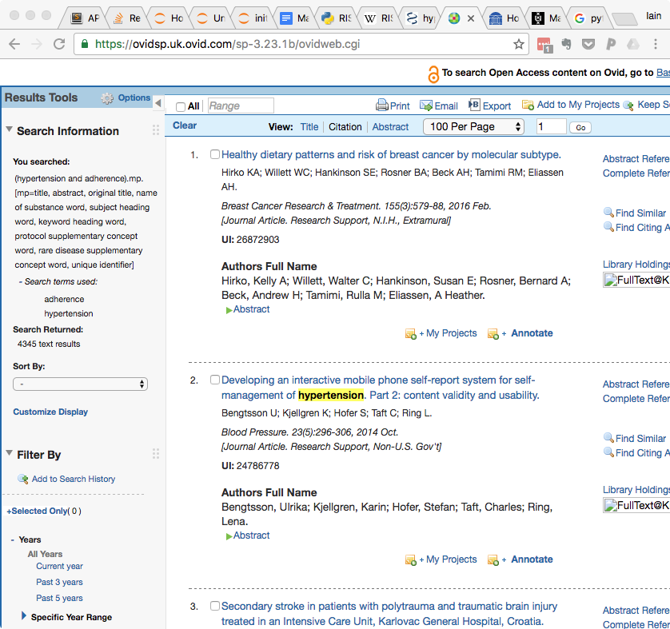
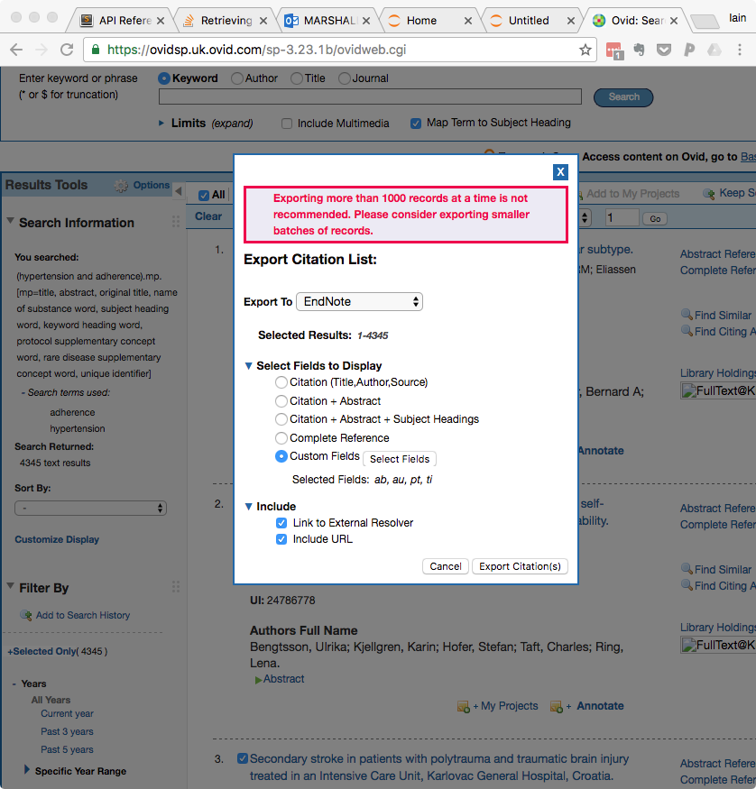

# RobotSearch

Software for filtering RCTs from a search result.

## How it works

RobotSearch uses machine learning as an alternative to string-based study design filters.

It works with MEDLINE searches exported from either PubMed or Ovid. 

You should conduct your search as normal (NB do not use any search terms or filters to restrict to RCTs at this stage!).

Then see the instructions below about how to export.

## Exporting from PubMed

1. Select 'Send to' (located in the upper left of the search results)
2. Under 'Choose Destination' select File
3. Under 'Format', select 'MEDLINE' from the pulldown menu
4. Click the 'Create File' button

## Exporting from Ovid

1. Click the tickbox next to **'All'** above the search results on the left hand side.
2. Click on Export
3. In the **'Export to'** pulldown menu, select 'RIS'
4. Under **'Select Fields to Display'** select 'Custom Fields', then click the 'Select Fields' button
5. In the **Select Fields** box, select the following fields: *ab*: Abstract, *pt*: Publication Type, and *ti*: Title. You may deselect any others.
6. Click 'Save' in the bottom left
7. Click 'Export Citation(s)' in the bottom right
8. The citations will be exported, but there may be a wait of a minute or two.

